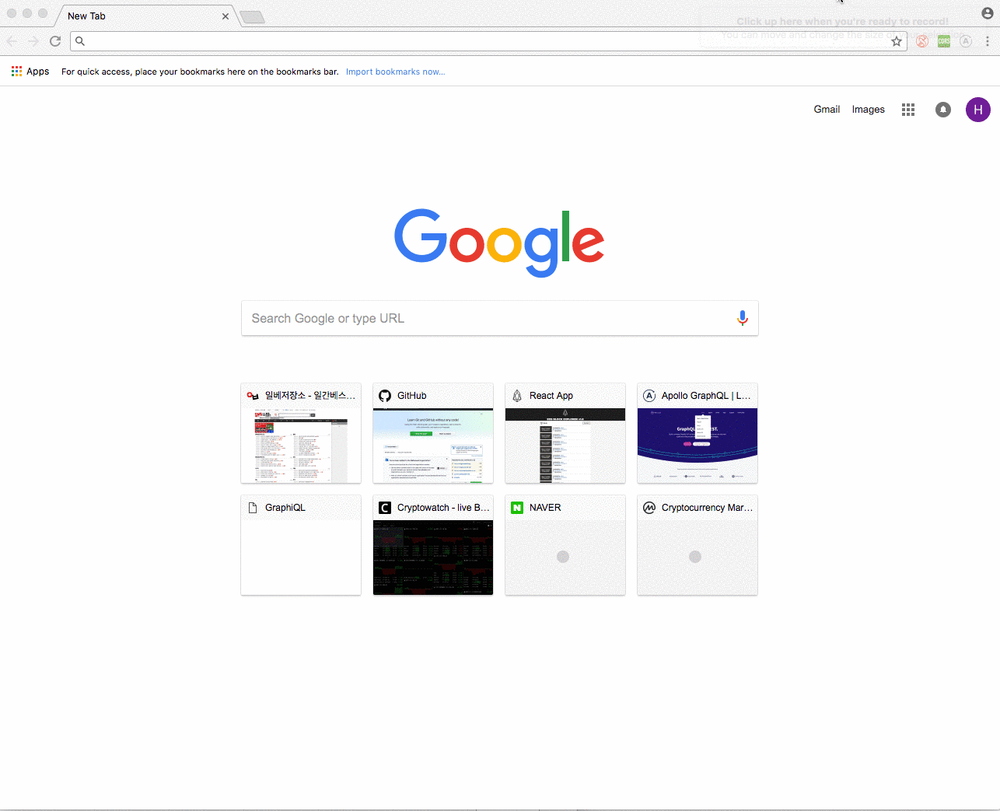

# eos.io block explorer v1.0 :four_leaf_clover:

> :zap: Simple and performant eos.io block explorer with server and client :zap:

### Before You Start... :pushpin:

This project is composed of express server to fetch block info from docker container running locally.
To try it out, you have to follow instructions from eos docker [README.md](https://github.com/EOSIO/eos/tree/master/Docker):link:  to run eos blockchain in your local container.
Client will hit graphql gateway in express server to fetch block info.

### Getting started :pushpin:

1. Run docker image 
``` bash
$ docker run --name nodeos -p 8888:8888 -p 9876:9876 -t eosio/eos nodeosd.sh arg1 arg2
```
2. Clone repo
``` bash
$ git clone git@github.com:sungju1203/eos-block-explorer.git
```

3. In both `apollo-server` and `client` folders, Run
``` bash
$ yarn install
$ yarn start
```

### Features :pushpin:
* create-react-app :white_check_mark:
* ES6 & 7, Async Await, React 16 :white_check_mark:
* apollo-graphql caching (express & client) :white_check_mark:
* styled-components :white_check_mark:
* eosjs and docker :white_check_mark:
* unit tests :white_check_mark:

### Demo :pushpin:
